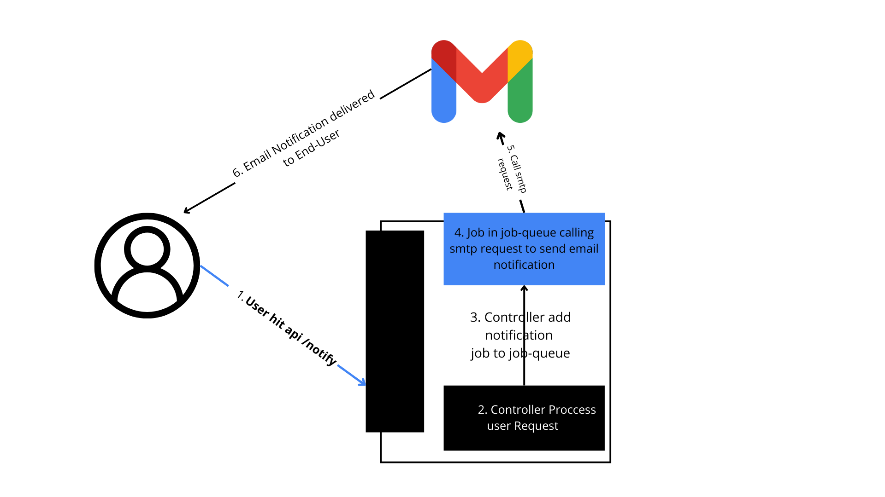
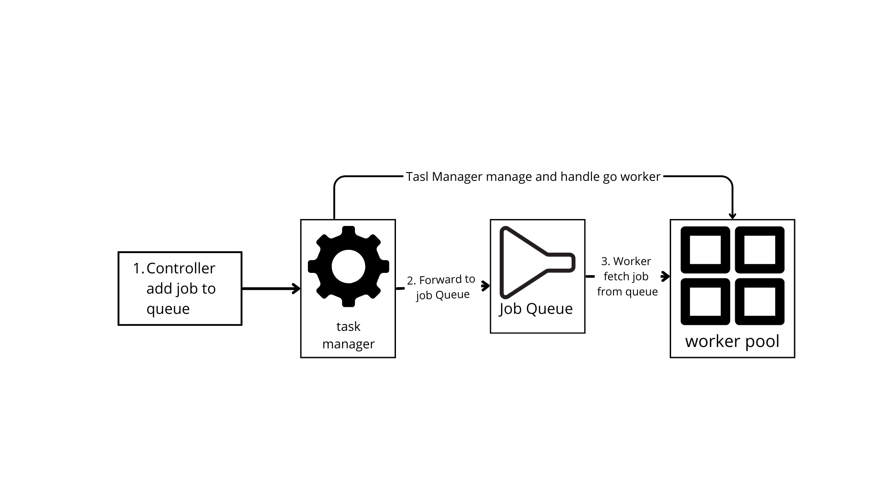

# BUILDING SIMPLE AND ROBUST MAIL NOTIFICATION SERVICE

## General Workflow
while do request to smtp it might consume significant amount of time. Even, We can wait until 5 seconds althought the work is very light. To address this problem, we can simply said that concurency is must, but how we implemented that?. 
To Implementing concurency we can use Worker Pool Design Pattern. The Controller can pass it into job queue and then returning a response immadiately. 
Here is the general workflow:


## Worker Pool and Concurency Design is Key
Worker pool is a useful design pattern, for managing concurency system. Worker pools limit the number of work units so that the system doesn't get burned out, but can still handle many tasks that come as queues
The Worker pool WorkFlow is depicted below: 


## API Documentation
1. Payload
payload is defined in json format as below:
```
{
    receiver string,
    message string
}
```
2. url
- `http://localhost:8080/api/mail` ... demonstrate sending email with concurency 
- `http://localhost:8080/api/mail/v2` ... demonstrate sending email without concurency 
